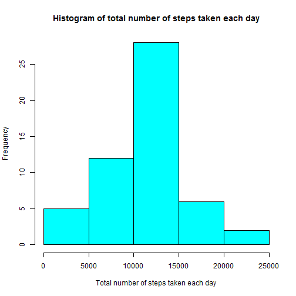
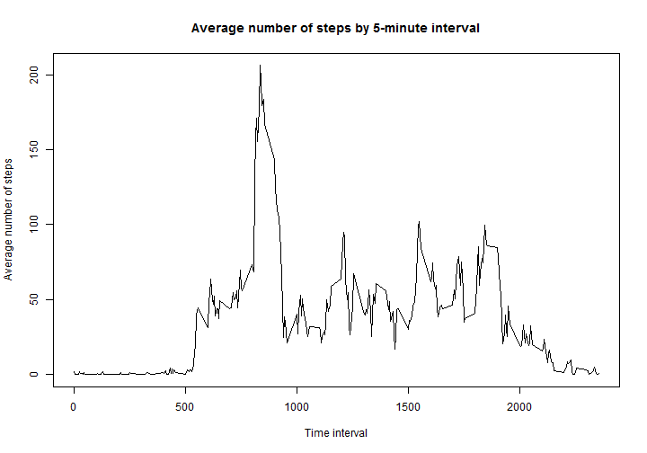
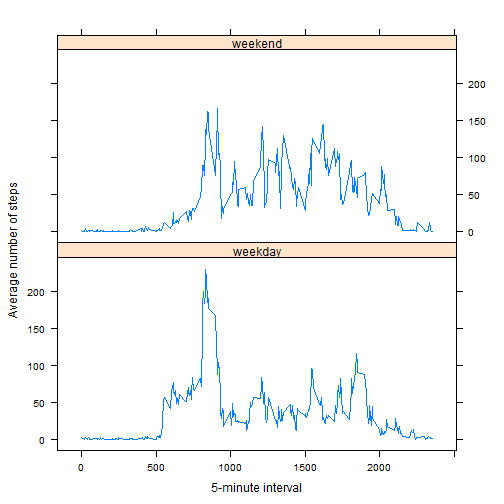

# Reproducible Research: Peer Assessment 1

This is first assessment in data science specialization for course Reproducible research. Specialization is offererd by John Hopkins University through Coursera.
For more information about data used in project please read README.md file.
## Loading and preprocessing the data


We load data activity.csv 

```r
data <- read.csv("activity.csv")
```


## What is mean total number of steps taken per day?

We produce histogram for


```r
hist(tapply(data$steps, data$date, sum), col = "cyan", main = "Histogram of total number of steps taken each day", 
    xlab = "Total number of steps taken each day", bg = "white")
```

 


We calculate the mean and the median

```r
mean(tapply(data$steps, data$date, sum, na.rm = TRUE))
```

```
## [1] 9354
```

```r
median(tapply(data$steps, data$date, sum, na.rm = T))
```

```
## [1] 10395
```

We can see that mean is smaller than median what means that distribution is right skewed.


## What is the average daily activity pattern?

To get average daily activity pattern we must preprocess our data. At the beggining of preprocessing we omit NA. Then we calculate mean number of steps for every time interval. On the and we add column names. Results are presented in plot below.

```r
data_1 <- na.omit(data)
data_1 <- aggregate(data_1$steps, list(data_1$interval), mean, na.action = "na.omit")
colnames(data_1) <- c("interval", "average_steps")
```


```r
plot(data_1$interval, data_1$average_steps, type = "l", main = "Average number of steps by 5-minute interval", 
    xlab = "Time interval", ylab = "Average number of steps", bg = "white")
```

 


On average across all the days in dataset the interval with highest number of steps is interval at 08:35 am.

```r
data_1[data_1$average_steps == max(data_1$average_steps), ]["interval"]
```

```
##     interval
## 104      835
```


## Imputing missing values


```r
number_of_NAs <- nrow(data) - nrow(na.omit(data))
```

The dataset has 2304 NA values. We replace those values by mean for that 5-minute interval across all days and save them in new data set named data_replaced.

```r
steps <- rep(data_1$average_steps, length(data)/length(data_1))

data_replaced <- data
data_replaced[is.na(data_replaced)] <- steps
```

Below, histogram with new dataset on total number of steps taken each day is produced. 


```r
hist(tapply(data_replaced$steps, data_replaced$date, sum), col = "green", main = "Histogram of total number of steps in one day", 
    xlab = "Total number of steps in one  day", bg = "white")
```

 


Now we calculate mean and median of total number of steps taken per day with new data. 

```r
mean(tapply(data_replaced$steps, data_replaced$date, sum))
```

```
## [1] 10766
```

```r
median(tapply(data_replaced$steps, data_replaced$date, sum))
```

```
## [1] 10766
```


We can see that median and mean are both higher as they are when we remove NA values. In case when we replace NA's the mean is equal as median so we can no longer talk about right skewed distribution as we did in case when NA's were removed. In that case mean was significantly lower than median. 

## Are there differences in activity patterns between weekdays and weekends?

To figure out if there ate any differences in weekday or weekend we preprocess the data.


```r
data_replaced$day <- weekdays(as.Date(data_replaced$date, format = "%Y-%m-%d"))
data_replaced$day[data_replaced$day == "Monday" | data_replaced$day == "Tuesday" | 
    data_replaced$day == "Wednesday" | data_replaced$day == "Thursday" | data_replaced$day == 
    "Friday"] <- "weekday"
data_replaced$day[data_replaced$day == "Saturday" | data_replaced$day == "Sunday"] <- "weekend"

data_last <- aggregate(data_replaced$steps, list(data_replaced$interval, data_replaced$day), 
    mean)
colnames(data_last) <- c("interval", "day", "step")
```

Then we make two panel plot with lattice package.


```r
library(lattice)

xyplot(data_last$step ~ data_last$interval | data_last$day, layout = c(1, 2), 
    type = "l", xlab = "5-minute interval", ylab = "Average number of steps", 
    bg = "white")
```

 

We can see that in weekday activity start increasing around 05:00 am and it increase is way more steep as is on weekend day. Also peak is way higher on weekday than it is on weekend day. But after 10:00 am the activity is more more frequent on weekend day than it is on weekday.

## References
[1] RStudio - Version 0.98.501 – © 2009-2013 RStudio, Inc.  
[2] Sarkar, Deepayan (2008) Lattice: Multivariate Data Visualization with R.
Springer, New York. ISBN 978-0-387-75968-5
